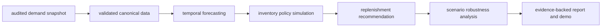

# Retail Demand — Inventory Decision Engine

**Pronóstico de demanda, simulación de políticas de inventario y decisiones de
reposición con resultados reproducibles y respaldados por evidencia** — desde un
snapshot de demanda auditado hasta una política recomendada que luego se
somete a pruebas de estrés bajo escenarios de negocio modelados.

**Estado**: implementación completa; el fixture sintético es la demo por
defecto; las evaluaciones deterministas acotadas sobre el snapshot real fijado
(v1 y v2) y un análisis de robustez de 12 escenarios están comprometidas como
evidencia.


> **IMPORTANTE — qué es un hecho y qué es un supuesto.** Los valores de demanda
> provienen de un **snapshot de fuente auditado** (FreshRetailNet-50K, revisión
> fijada). Todo lo demás — **tiempos de entrega, objetivos de servicio,
> períodos de revisión y multiplicadores de costo** — es un **supuesto modelado**,
> no un costo o contrato observado. Las evaluaciones reales son
> **deterministas y acotadas a sus poblaciones declaradas y no generalizan**. La
> demo por defecto y el reporte de fixture son
> **`Synthetic fixture — not a real business result`**.

## Resultados verificados (acotados, con denominadores)

| Resultado | Alcance / denominador | Dónde |
|---|---|---|
| **Fixture sintético** es la demo por defecto, offline, etiquetado `Synthetic fixture — not a real business result` | 2 SKUs, ~120 días, contenido sintético con licencia MIT (no derivado de datos de fuente) | `data/evaluations/experiment_report.json` |
| **Línea base real v1** — `Deterministic bounded evaluation over pinned snapshot` | primeras 10 de 50,000 claves elegibles por `(store_id, product_id)`; 970 de 4,850,000 filas de fuente | `data/evaluations/freshretailnet-real-report.json` |
| **Real v2 expandido** — `Deterministic expanded bounded evaluation over pinned snapshot` | 100 claves / 10 tiendas / 40 productos; 9,000 train + 700 eval rows (9,700) de un snapshot de fuente de 4,850,000 filas | `data/evaluations/freshretailnet-real-expanded-report.json` |
| **Robustez** — `Deterministic robustness evaluation over the v2 population (modeled business assumptions)` | **12 escenarios congelados pre-registrados**; política retenida en **≈98,3 % (1,081 de 1,100)** pares escenario-clave no baseline; 1,7 % (19) cambiaron; 10,7 % (118) infactibles con fallback documentado; restricción de servicio cumplida en 89,3 % (982) de los pares | `data/evaluations/freshretailnet-robustness-report-v1.0.0.json` |
| **MAE de test final v2** (modelo seleccionado, fuera de muestra, en las 100 claves) | mediana **0,33**, p25 0,23, p75 0,62, p95 1,58 | reporte v2, `expanded.aggregates.final_test_forecast.per_key.mae` |
| **Restricción de servicio v2** | 87 de 100 claves cumplen el nivel de servicio objetivo; 13 por debajo (13 infactibles, fallback transparente) | reporte v2, `expanded.aggregates.policy` |

Nada aquí está etiquetado **óptimo**, **listo para producción**,
**representativo** o **universal** — cada número está acotado a la población y el
protocolo que lo produjo.

## Por qué existe

Los pronósticos de demanda no son decisiones de reposición. El pronóstico
responde *"¿cuánto se venderá?"*; las políticas de inventario responden *"¿cuánto
debo mantener y cuándo debo reponer?"*; y ninguna respuesta es confiable hasta que
se simula contra una política y se somete a pruebas de estrés bajo supuestos que
podrían estar equivocados. Este proyecto construye esa cadena completa con
**evidencia reproducible en cada paso** — versiones, seeds, run IDs, checksums y
reportes comprometidos — de modo que un lector pueda verificar cualquier número
en lugar de confiar en él.

## Qué hace

1. **Valida un snapshot de demanda auditado** en una capa de datos canónica y
   tipada.
2. **Pronostica** la demanda con cuatro modelos detrás de una única interfaz
   `fit / predict`.
3. **Simula** inventario diario con ventas perdidas bajo dos familias de
   políticas.
4. **Recomienda** una política por *costo total mínimo sujeto a un objetivo de
   nivel de servicio*, adjuntando evidencia (run IDs, versiones, rutas de
   reporte) a cada decisión.
5. **Somete a pruebas de estrés** la recomendación bajo una matriz congelada de
   12 escenarios de supuestos de costo, tiempo de entrega, período de revisión y
   demanda modelados.
6. **Publica** reportes JSON deterministas y una demo offline.

## Pipeline de un vistazo



Los hechos de fuente (el snapshot y sus checksums) se mantienen **separados** de
los pronósticos (salidas de modelos), **separados** de los supuestos modelados
(tiempos de entrega, objetivos de servicio, costos), **separados** de las
recomendaciones (política seleccionada + evidencia) y **separados** de la
evidencia de robustez (cómo se comporta la decisión cuando cambian los supuestos
modelados).

## Demo

`docs/assets/publication/*` son capturas de pantalla reales de la aplicación en
vivo. La demo es fixture-por-defecto, lee solo archivos comprometidos y nunca
toca `data/raw/`.

| Vista | Qué muestra |
|---|---|
|  | Historial de demanda, pronóstico de test final vs real, pronóstico de despliegue y métricas de error fuera de muestra |
|  | Cada política candidata simulada con nivel de servicio, fill rate, stockouts y costo total |
|  | Política seleccionada, cantidad de pedido, servicio/costo simulados, run ID de evidencia y sensibilidad a la escala de demanda |
|  | Selector de 12 escenarios, comparación baseline-vs-escenario y retención acotada entre claves |

El selector de escenarios y el panel de robustez se aplican a un **SKU de fixture
que no tiene contraparte en el reporte real**, por lo que el panel muestra
honestamente la estabilidad a nivel de escenario en la población real v2 acotada
en lugar de una comparación real por clave. Ejecútela con:

```bash
uv sync --dev --extra demo
uv run --extra demo streamlit run scripts/demo_forecast.py
```

## Datos y procedencia

- **Fuente**: [FreshRetailNet-50K](https://huggingface.co/datasets/Dingdong-Inc/FreshRetailNet-50K)
  (Dingdong Limited), revisión fijada
  [08c1fab7…d351d4](https://huggingface.co/datasets/Dingdong-Inc/FreshRetailNet-50K/tree/08c1fab7f9257bc73679d415d65d644165d351d4),
  [CC BY 4.0](https://creativecommons.org/licenses/by/4.0/legalcode).
  Auditoría, licencia textual, mapeo, missingness y reglas de censura por
  stockout:
  [`docs/source-contract.md`](docs/source-contract.md).
- **Los archivos crudos nunca se comprometen.** La adquisición verifica tamaños
  de bytes, SHA-256 crudo y la revisión fijada antes de registrar checksums en
  `data/manifests/freshretailnet-real.json`; todo después de la adquisición se
  ejecuta offline.
- **Semántica de stockout**: derivada del campo documentado
  `stock_hour6_22_cnt > 0`; un valor faltante permanece desconocido; ventas cero
  nunca implican un stockout. Los pronósticos apuntan a las ventas observadas; la
  demanda censurada durante stockouts se documenta, no se recupera.

## Pronóstico

Cuatro modelos detrás de una interfaz (`src/retail_demand_inventory/forecasting/`):
naive, moving average, suavizado exponencial simple y un
`HistGradientBoostingRegressor` supervisado que usa solo lags anteriores,
estadísticas móviles y características de calendario. Los modelos se seleccionan
**solo sobre folds de validación** (MAE agrupado mínimo, desempate por WMAPE y
luego por id de modelo); el fold de test final nunca se usa para la selección.

## Simulación

Un simulador de inventario diario determinista con **ventas perdidas**
(`src/retail_demand_inventory/simulation/`) para dos familias de políticas:
reorder-point/order-quantity y order-up-to/safety-stock. Cada ejecución es
reproducible (seed fijo) y emite un run ID auditable con versiones de política y
componentes de costo.

## Decisión y robustez

La capa de decisión (`src/retail_demand_inventory/decisions/`) selecciona la
política que minimiza el costo simulado total cumpliendo el objetivo de nivel de
servicio, con un fallback transparente y documentado cuando ningún candidato
satisface la restricción. La robustez
([`docs/robustness-protocol.md`](docs/robustness-protocol.md)) re-ejecuta este
pipeline sobre una **matriz congelada de 12 escenarios** en la población v2,
reportando retención de política, deltas de order/reorder-point, factibilidad y
resúmenes de transición. Las definiciones de escenarios y los supuestos modelados
están versionados y con checksum
(`data/manifests/robustness-scenarios-v1.0.0.json`).

## Evaluación

El protocolo de evaluación ([`docs/evaluation-protocol.md`](docs/evaluation-protocol.md)) fija
splits, seed, horizonte, métricas, la regla de población real y las reglas de
selección *antes* de que se produzca cualquier número. Las evaluaciones reales
están etiquetadas `Deterministic bounded evaluation over pinned snapshot` (v1) y
`Deterministic expanded bounded evaluation over pinned snapshot` (v2): están
acotadas a sus poblaciones declaradas y no generalizan a todos los minoristas.

El artefacto de robustez comprometido
(`data/evaluations/freshretailnet-robustness-report-v1.0.0.json`, ≈19,9 MB
pretty-printed / ≈10,4 MB compact) se **preserva sin cambios**: retiene
intencionalmente el detalle completo de candidato, evidencia y procedencia por
clave (12 escenarios × 100 claves) por auditabilidad en lugar de ser
deduplicado, de modo que sus métricas, relaciones por clave y resúmenes
deterministas permanecen intactos.

## Ejecución local

```bash
uv sync --dev
uv run pytest                 # 214 tests, comportamiento real, sin red
uv run ruff check .
uv run ruff format --check .
uv lock --check
uv run --extra demo streamlit run scripts/demo_forecast.py
```

Para regenerar el reporte de fixture (offline): `uv run python -m
retail_demand_inventory.evaluation.materialize`. Los comandos de materialización
de snapshot real y robustez están en
[`docs/demo-script.md`](docs/demo-script.md) y [`docs/evaluation-protocol.md`](docs/evaluation-protocol.md).

## Arquitectura

```text
src/retail_demand_inventory/
├── versions.py
├── data/
├── forecasting/
├── simulation/
├── decisions/
└── evaluation/
```

- `versions.py`: identificadores de versión de paquete/esquema/protocolo.
- `data/`: contracts, loaders, manifests reales, parquet loader, CLIs de
  adquisición + schema-report, splits cronológicos.
- `forecasting/`: interfaz base, baselines, features, models.
- `simulation/`: policies, engine, events, outcomes (ventas perdidas diarias).
- `decisions/`: recommendation, ranking, evidence, escenarios manifest.
- `evaluation/`: metrics, backtesting, reports, CLIs de materializer, agregación
  de robustez + materializer.

## Estructura del repositorio

```text
src/retail_demand_inventory/
tests/
docs/
docs/assets/publication/
data/fixtures/
data/manifests/
data/evaluations/
data/raw/ data/processed/
deploy/
scripts/demo_forecast.py
```

- `src/retail_demand_inventory/`: paquete (layout src).
- `tests/`: pytest; solo tests reales.
- `docs/`: source contract, protocolo de evaluación/robustez, demo script,
  borrador de LinkedIn.
- `docs/assets/publication/`: capturas de pantalla de la demo en vivo.
- `data/fixtures/`: fixtures versionados pequeños.
- `data/manifests/`: manifests versionados (fuentes, población, escenarios).
- `data/evaluations/`: reportes de evaluación deterministas comprometidos.
- `data/raw/ data/processed/`: salida de ejecución gitignored (nunca
  comprometida).
- `deploy/`: notas de despliegue (más adelante).
- `scripts/demo_forecast.py`: demo de Streamlit.

## Limitaciones

- La demo por defecto, los tests y el reporte de fixture son sintéticos
  (`Synthetic fixture — not a real business result`); ningún número de fixture es
  un resultado del mundo real.
- Los resultados de snapshot real son evaluaciones deterministas acotadas sobre
  el snapshot fijado — no full-dataset, no producción y **no generalizables**.
- Los tiempos de entrega, objetivos de servicio, períodos de revisión y
  multiplicadores de costo son supuestos modelados, no costos o contratos
  observados; la robustez muestra cómo *se comportan* las decisiones bajo esos
  supuestos, no valida los supuestos.
- La robustez se aplica a la población v2; las comparaciones por clave son reales
  solo para claves reales v2 (la demo usa un SKU de fixture y muestra estabilidad
  acotada a nivel de escenario en su lugar).
- Sin ajuste de hiperparámetros por SKU; solo defaults fijos documentados. Los
  modelos usan lags, estadísticas móviles y características de calendario — sin
  features de descuentos, festivos, actividad ni clima.

## Licencia

El código de este repositorio es MIT (ver `LICENSE`). El dataset referenciado
(FreshRetailNet-50K) conserva sus propios términos CC BY 4.0; `data/raw/` y
`data/processed/` nunca se comprometen.
