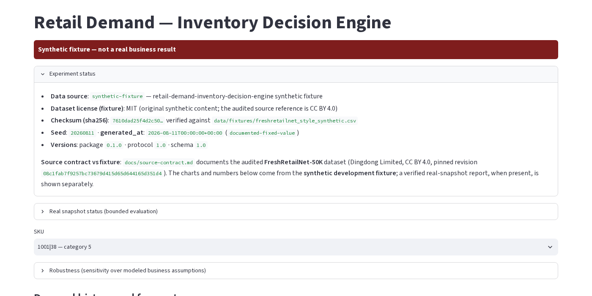
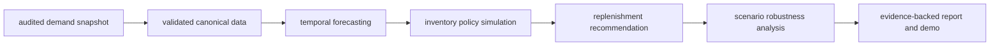
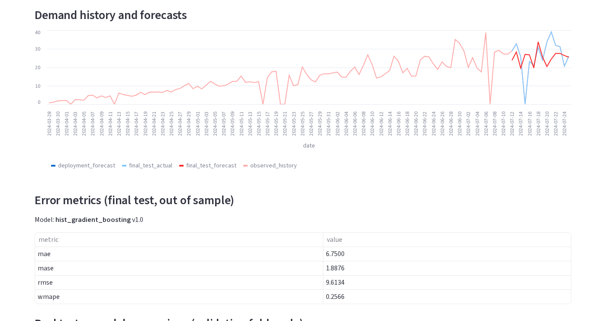
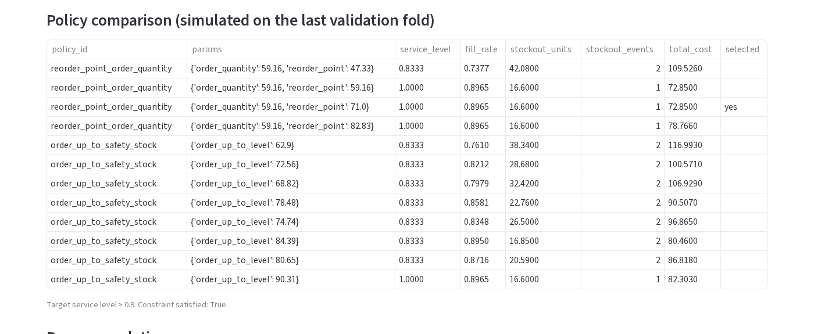
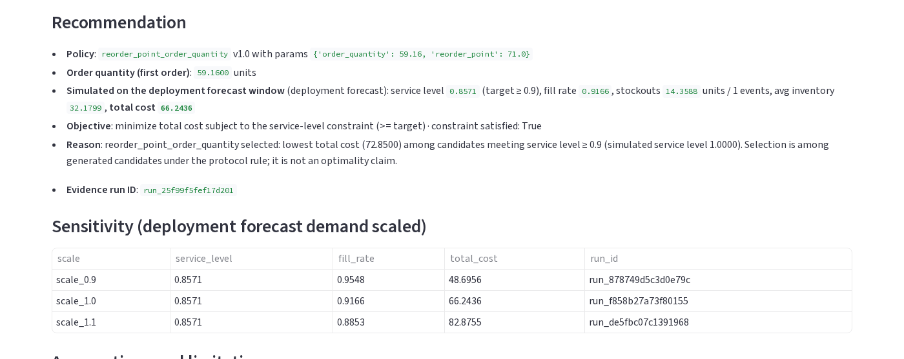
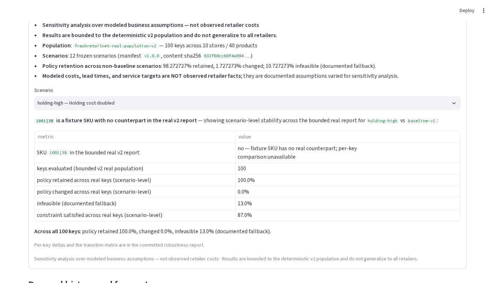

# Retail Demand — Inventory Decision Engine

**Demand forecasting, inventory policy simulation, and replenishment decisions
with reproducible, evidence-backed results** — from an audited demand snapshot
to a recommended policy that is then stress-tested under modeled business
scenarios.

**Status**: implementation complete; synthetic fixture is the default demo;
deterministic bounded evaluations over the pinned real snapshot (v1 and v2) and
a 12-scenario robustness analysis are committed as evidence.



> **IMPORTANT — what is fact and what is assumed.** Demand values come from an
> **audited source snapshot** (FreshRetailNet-50K, pinned revision). Everything
> else — **lead times, service targets, review periods, and cost multipliers** —
> is a **modeled assumption**, not an observed cost or contract. The real
> evaluations are **deterministic and bounded to their stated populations and do
> not generalize**. The default demo and fixture report are
> **`Synthetic fixture — not a real business result`**.

## Verified results (scoped, with denominators)

| Result | Scope / denominator | Where |
|---|---|---|
| **Synthetic fixture** is the default demo, offline, labeled `Synthetic fixture — not a real business result` | 2 SKUs, ~120 days, MIT-licensed synthetic content (not derived from source data) | `data/evaluations/experiment_report.json` |
| **Real v1 baseline** — `Deterministic bounded evaluation over pinned snapshot` | first 10 of 50,000 qualifying keys by `(store_id, product_id)`; 970 of 4,850,000 source rows | `data/evaluations/freshretailnet-real-report.json` |
| **Real v2 expanded** — `Deterministic expanded bounded evaluation over pinned snapshot` | 100 keys / 10 stores / 40 products; 9,000 train + 700 eval rows (9,700) from a 4,850,000-row source snapshot | `data/evaluations/freshretailnet-real-expanded-report.json` |
| **Robustness** — `Deterministic robustness evaluation over the v2 population (modeled business assumptions)` | **12 pre-registered frozen scenarios**; policy retained in **≈98.3% (1,081 of 1,100)** non-baseline scenario-key pairs; 1.7% (19) changed; 10.7% (118) infeasible with documented fallback; service constraint met in 89.3% (982) of pairs | `data/evaluations/freshretailnet-robustness-report-v1.0.0.json` |
| **v2 final-test MAE** (selected model, out of sample, across the 100 keys) | median **0.33**, p25 0.23, p75 0.62, p95 1.58 | v2 report, `expanded.aggregates.final_test_forecast.per_key.mae` |
| **v2 service constraint** | 87 of 100 keys meet the target service level; 13 below (13 infeasible, transparent fallback) | v2 report, `expanded.aggregates.policy` |

Nothing here is labeled **optimal**, **production-ready**, **representative**, or
**universal** — every number is bounded to the population and protocol that
produced it.

## Why this exists

Demand forecasts are not replenishment decisions. Forecasting answers *"how much
will sell?"*; inventory policies answer *"how much should I hold and when should
I reorder?"*; and neither answer is trustworthy until it is simulated against a
policy and stress-tested under assumptions that could be wrong. This project
builds that full chain with **reproducible evidence at every step** — versions,
seeds, run IDs, checksums, and committed reports — so a reader can verify any
number instead of trusting it.

## What it does

1. **Validates an audited demand snapshot** into a typed, canonical data layer.
2. **Forecasts** demand with four models behind one `fit / predict` interface.
3. **Simulates** daily lost-sales inventory under two policy families.
4. **Recommends** a policy by *min total cost subject to a service-level target*,
   attaching evidence (run IDs, versions, report paths) to every decision.
5. **Stress-tests** the recommendation under a frozen 12-scenario matrix of
   modeled cost, lead-time, review-period, and demand assumptions.
6. **Publishes** deterministic JSON reports and an offline demo.

## Pipeline at a glance



Source facts (the snapshot and its checksums) are kept **separate** from
forecasts (model outputs), **separate** from modeled assumptions (lead times,
service targets, costs), **separate** from recommendations (selected policy +
evidence), and **separate** from robustness evidence (how the decision behaves
when the modeled assumptions change).

## Demo

`docs/assets/publication/*` are real screenshots of the live app. The demo is
fixture-default, reads only committed files, and never touches `data/raw/`.

| View | What it shows |
|---|---|
|  | Demand history, final-test forecast vs actual, deployment forecast, and out-of-sample error metrics |
|  | Every simulated candidate policy with service level, fill rate, stockouts, and total cost |
|  | Selected policy, order quantity, simulated service/cost, evidence run ID, and demand-scale sensitivity |
|  | 12-scenario selector, baseline-vs-scenario comparison, and bounded cross-key retention |

The scenario selector and robustness panel apply to a **fixture SKU that has no
counterpart in the real report**, so the panel honestly shows scenario-level
stability across the bounded real v2 population instead of a per-key real
comparison. Run it with:

```bash
uv sync --dev --extra demo
uv run --extra demo streamlit run scripts/demo_forecast.py
```

## Data and provenance

- **Source**: [FreshRetailNet-50K](https://huggingface.co/datasets/Dingdong-Inc/FreshRetailNet-50K)
  (Dingdong Limited), pinned revision
  [08c1fab7…d351d4](https://huggingface.co/datasets/Dingdong-Inc/FreshRetailNet-50K/tree/08c1fab7f9257bc73679d415d65d644165d351d4),
  [CC BY 4.0](https://creativecommons.org/licenses/by/4.0/legalcode).
  Audit, verbatim license, mapping, missingness, and stockout-censoring rules:
  [`docs/source-contract.md`](docs/source-contract.md).
- **Raw files are never committed.** Acquisition verifies byte sizes, raw
  SHA-256, and the pinned revision before recording checksums in
  `data/manifests/freshretailnet-real.json`; everything after acquisition runs
  offline.
- **Stockout semantics**: derived from the documented `stock_hour6_22_cnt > 0`
  field; a missing value stays unknown; zero sales never imply a stockout.
  Forecasts target observed sales; censored demand during stockouts is
  documented, not recovered.

## Forecasting

Four models behind one interface (`src/retail_demand_inventory/forecasting/`):
naive, moving average, simple exponential smoothing, and a supervised
`HistGradientBoostingRegressor` using only prior lags, rolling statistics, and
calendar features. Models are selected on **validation folds only** (min pooled
MAE, tie-break WMAPE then model id); the final test fold is never used for
selection.

## Simulation

A deterministic daily **lost-sales** inventory simulator
(`src/retail_demand_inventory/simulation/`) for two policy families:
reorder-point/order-quantity and order-up-to/safety-stock. Every run is
reproducible (fixed seed) and emits an auditable run ID with policy versions and
cost components.

## Decision and robustness

The decision layer (`src/retail_demand_inventory/decisions/`) selects the policy
that minimizes total simulated cost while meeting the service-level target, with
a transparent, documented fallback when no candidate satisfies the constraint.
Robustness ([`docs/robustness-protocol.md`](docs/robustness-protocol.md)) re-runs this pipeline over a
**frozen 12-scenario matrix** on the v2 population, reporting policy retention,
order/reorder-point deltas, feasibility, and transition summaries. Scenario
definitions and modeled assumptions are versioned and checksummed
(`data/manifests/robustness-scenarios-v1.0.0.json`).

## Evaluation

The evaluation protocol ([`docs/evaluation-protocol.md`](docs/evaluation-protocol.md)) fixes splits, seed,
horizon, metrics, the real-population rule, and selection rules *before* any
number is produced. The real evaluations are labeled
`Deterministic bounded evaluation over pinned snapshot` (v1) and
`Deterministic expanded bounded evaluation over pinned snapshot` (v2): they are
bounded to their stated populations and do not generalize to all retailers.

The committed robustness artifact
(`data/evaluations/freshretailnet-robustness-report-v1.0.0.json`, ≈19.9 MB
pretty-printed / ≈10.4 MB compact) is **preserved unchanged**: it intentionally
retains full per-key candidate, evidence, and provenance detail (12 scenarios ×
100 keys) for auditability rather than being deduplicated, so its metrics,
per-key relationships, and deterministic digests stay intact.

## Run locally

```bash
uv sync --dev
uv run pytest                 # 214 tests, real behavior, no network
uv run ruff check .
uv run ruff format --check .
uv lock --check
uv run --extra demo streamlit run scripts/demo_forecast.py
```

To regenerate the fixture report (offline): `uv run python -m
retail_demand_inventory.evaluation.materialize`. Real-snapshot and robustness
materialization commands are in [`docs/demo-script.md`](docs/demo-script.md) and [`docs/evaluation-protocol.md`](docs/evaluation-protocol.md).

## Architecture

```text
src/retail_demand_inventory/
├── versions.py       # package/schema/protocol version identifiers
├── data/             # contracts, loaders, real manifests, parquet loader,
│                     # acquisition + schema-report CLIs, chronological splits
├── forecasting/      # base interface, baselines, features, models
├── simulation/       # policies, engine, events, outcomes (daily lost-sales)
├── decisions/        # recommendation, ranking, evidence, scenarios manifest
└── evaluation/       # metrics, backtesting, reports, materializer CLIs,
                      # robustness aggregation + materializer
```

## Repository structure

```text
src/retail_demand_inventory/   # package (src layout)
tests/                         # pytest; real tests only
docs/                          # source contract, evaluation/robustness protocol,
                               # demo script, LinkedIn draft
docs/assets/publication/       # screenshots of the live demo
data/fixtures/                 # small versioned fixtures
data/manifests/                # versioned manifests (sources, population, scenarios)
data/evaluations/              # committed deterministic evaluation reports
data/raw/ data/processed/      # gitignored runtime output (never committed)
deploy/                        # deployment notes (later)
scripts/demo_forecast.py       # Streamlit demo
```

## Limitations

- Default demo, tests, and fixture report are synthetic
  (`Synthetic fixture — not a real business result`); no fixture number is a
  real-world result.
- Real-snapshot results are deterministic bounded evaluations over the pinned
  snapshot — not full-dataset, not production, and **not generalizable**.
- Lead times, service targets, review periods, and cost multipliers are modeled
  assumptions, not observed costs or contracts; robustness shows how decisions
  *behave* under those assumptions, it does not validate the assumptions.
- Robustness applies to the v2 population; per-key comparisons are real only for
  real v2 keys (the demo uses a fixture SKU and shows bounded scenario-level
  stability instead).
- No per-SKU hyperparameter tuning; fixed documented defaults only. Models use
  lags, rolling statistics, and calendar features — no discount, holiday,
  activity, or weather features.

## License

This repository's code is MIT (see `LICENSE`). The referenced dataset
(FreshRetailNet-50K) retains its own CC BY 4.0 terms; `data/raw/` and
`data/processed/` are never committed.
